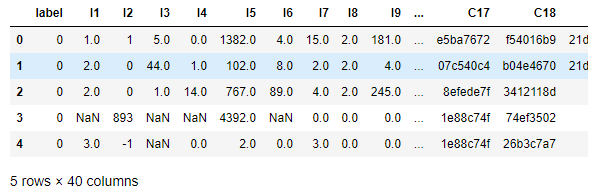
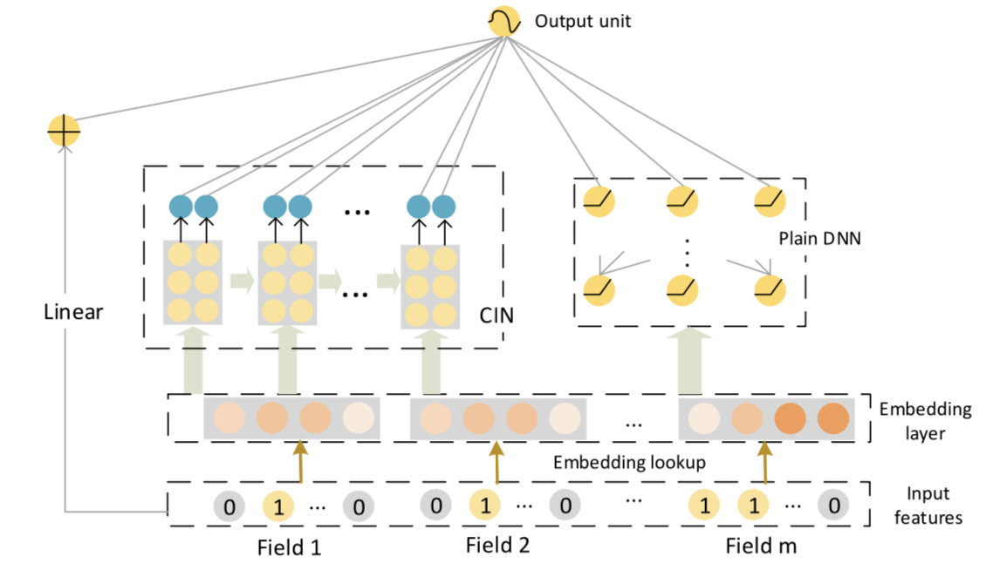
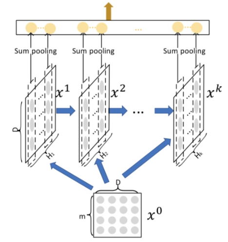
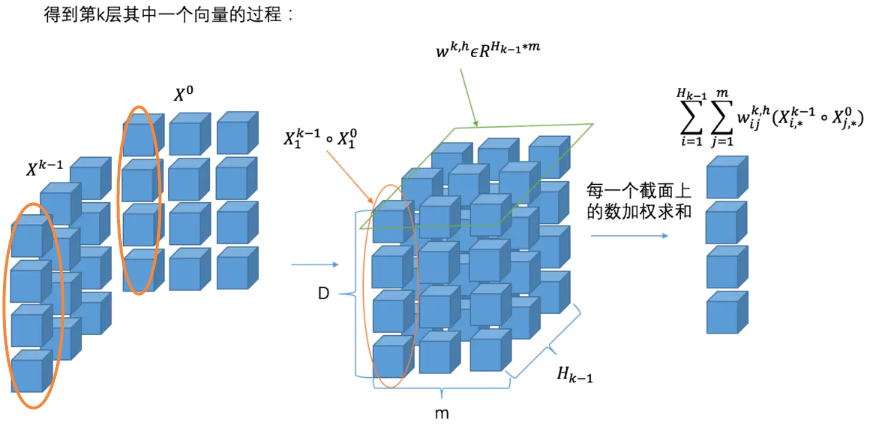

# tensorflow2.0 实现的 xDeepFM，使用 Criteo 子数据集加以实践。
本文的 CSDN 地址：https://blog.csdn.net/VariableX/article/details/107736113
本篇文章讲解 xDeepFM 的 tensorflow2.0 实现，并使用 Criteo 数据集的子集加以实践。如果在看本文时有所困惑，可以看看 xDeepFM 的相关理论：[CTR 模型之 Deep & Cross (DCN) 与 xDeepFM 解读](https://blog.csdn.net/VariableX/article/details/107708856)。

本文使用的数据下载地址于代码获取地址在文末获取。

首先了解一下 Criteo数据集，它由有39个特征，1个label列，其中以I开头的为数值型特征，以C开头的为类别特征：



可以看到数据中有缺失值需要填充，并且类别变量需要进行类别编码(onehot 编码的任务交给模型)，这部分预处理的代码不详细讲了。

为了方便后面建立模型，先将特征划分为 dense 特征与 sparse 特征两个类别：

```python
# 数值型
dense_feats = [f for f in cols if f[0] == "I"]
# 类别型
sparse_feats = [f for f in cols if f[0] == "C"]
```

xDeepFM 网络结构如下：



### 构造模型输入

对于 dense 特征，按下面的代码构造输入：

```python
# 构造每个 dense 特征的输入
dense_inputs = []
for f in dense_feats:
    _input = Input([1], name=f)
    dense_inputs.append(_input)

# 将输入拼接到一起
concat_dense_inputs = Concatenate(axis=1)(dense_inputs)  # ?, 13

# 对dense特征加权求和
fst_order_dense_layer = Dense(1)(concat_dense_inputs)
```

上面代码的注释中 ？ 表示输入数据的 batch_size。

对于每一个 sparse 特征，一般都是进行one-hot以后再转化为embedding特征，但实际上由于稀疏性的存在，很多位置的 $x_i$ 取0时，对应的 $w_i x_i$  也为0。因此，可以将 sparse 特征 embedding 到 1维，然后通过 embedding lookup 的方式来找到对应的 $w_i$ 。

这里举个例子：假设我们的性别特征取值有-1，0，1三种，某个样本的取值为1，则其one-hot以后为[0, 0, 1]向量，我们进行线性回归时会得到 $w_1 \times 0 + w_2 \times 0 +w_3 \times 1$ ，仅仅只有 $w_3$ 被保留下来。因此，可以对性别构造一个 3*1 的 embedding 向量，然后通过 embedding  lookup 得到系数。

对于 sparse 特征，按下面的代码构造输入：

```python
# 这里单独对每一个 sparse 特征构造输入，
# 目的是方便后面构造二阶组合特征
sparse_inputs = []
for f in sparse_feats:
    _input = Input([1], name=f)
    sparse_inputs.append(_input)
    
sparse_1d_embed = []
for i, _input in enumerate(sparse_inputs):
    f = sparse_feats[i]
    voc_size = total_data[f].nunique()
    # 使用 l2 正则化防止过拟合
    reg = tf.keras.regularizers.l2(0.5)
    _embed = Embedding(voc_size, 1, embeddings_regularizer=reg)(_input)
    # 由于 Embedding 的结果是二维的，
    # 因此如果需要在 Embedding 之后加入 Dense 层，则需要先连接上 Flatten 层
    _embed = Flatten()(_embed)
    sparse_1d_embed.append(_embed)
    
# 对sparse特征加权求和
fst_order_sparse_layer = Add()(sparse_1d_embed)
```

然后将 dense 特征与 sparse 特征加权求和结果相加，完成模型最左侧的 Linear 部分：

```python
linear_part = Add()([fst_order_dense_layer, fst_order_sparse_layer])
```

## Compressed Interaction Network

终于来到最核心的 CIN 部分，此部分的网络结构如下图所示：



CIN 的输入来自 embedding 层，假设有 m 个 field，每个 field 的 embedding 维度为 D ，则输入可以表示为矩阵 $X^0 \in \mathbb R^{m * D}$。为了得到 $X^0$，在进入 CIN 网络之前，需要先将 sparse 特征进行 embedding 并构建 $X^0$：

```python
# embedding size
D = 8

# 只考虑sparse的二阶交叉
sparse_kd_embed = []
for i, _input in enumerate(sparse_inputs):
    f = sparse_feats[i]
    voc_size = data[f].nunique()
    reg = tf.keras.regularizers.l2(0.7)
    _embed = Embedding(voc_size+1, D, embeddings_regularizer=reg)(_input)
    sparse_kd_embed.append(_embed)
    
# 构建feature mmap X0
input_feature_map = Concatenate(axis=1)(sparse_kd_embed)
```

CIN 内部有 k 层，每一层都会输出一个矩阵 $X^k \in \mathbb R^{H_k * D}$ ，k 表示第 k 层的输出， $H_k$ 表示第 k 层有 $H_k$ 个维度为 D 的向量。要得到 $X^{k}$ ，需要接收两个矩阵作为输入，一个是 $X^{k-1}$ ，另一个是 $X^0$ ，具体的计算公式如下：
$$
\boldsymbol{X}_{h, *}^{k}=\sum_{i=1}^{H_{k-1}} \sum_{j=1}^{m} \boldsymbol{W}_{i j}^{k, h}\left(\boldsymbol{X}_{i, *}^{k-1} \circ \boldsymbol{X}_{j, *}^{0}\right) \in \mathbb{R}^{1 * D}, \quad \text { where } 1 \leq h \leq H_{k}
$$
其中 $W^{k, h} \in \mathbb R^{H_{k-1} * m}$，表示要得到第 k 层第 h 个向量所需要的权重矩阵， $H_{k-1}$ 表示第 $k-1$ 层的输出矩阵 $X^{k-1}$ 由 $H_{k-1}$ 个维度为 D 的向量组成。$\circ$ 表示Hadamard乘积。式子中 $\boldsymbol{X}_{i, *}^{k-1} \circ \boldsymbol{X}_{j, *}^{0}$ 是表示取出 $X^{k-1}$ 的第 $i$ 个向量与输入层 $X^{0}$ 中第 $j$ 个向量进行 Hadamard 乘积运算。这个部分的计算过程如下图所示：



此公式的实现代码如下：

```python
def compressed_interaction_net(x0, xl, D, n_filters):
    """
    @param x0: 原始输入
    @param xl: 第l层的输入
    @param D: embedding dim
    @param n_filters: 压缩网络filter的数量
    """
    # 这里设x0中共有m个特征，xl中共有h个特征
    
    # 1.将x0与xl按照k所在的维度（-1）进行拆分，每个都可以拆成D列
    x0_cols = tf.split(x0, D, axis=-1)  # ?, m, D
    xl_cols = tf.split(xl, D, axis=-1)  # ?, h, D
    
    assert len(x0_cols)==len(xl_cols), print("error shape!")
    
    # 2.遍历D列，对于x0与xl所在的第i列进行外积计算，存在feature_maps中
    feature_maps = []
    for i in range(D):
        # transpose_b=True 将 x0_cols[i] 转置
        feature_map = tf.matmul(xl_cols[i], x0_cols[i], transpose_b=True)  # 外积 ?, h, m
        feature_map = tf.expand_dims(feature_map, axis=-1)  # ?, h, m, 1
        feature_maps.append(feature_map)
    
    # 3.得到 h × m × D 的三维tensor
    feature_maps = Concatenate(axis=-1)(feature_maps)  # ?, h, m, D
    
    # 3.压缩网络
    x0_n_feats = x0.get_shape()[1]  # m
    xl_n_feats = xl.get_shape()[1]  # h
    reshaped_feature_maps = Reshape(target_shape=(x0_n_feats * xl_n_feats, D))(feature_maps)  # ?, h*m, D
    transposed_feature_maps = tf.transpose(reshaped_feature_maps, [0, 2, 1])  # ?, D, h*m
    
    # Conv1D：使用 n_filters 个形状为 1 * (h*m) 的卷积核以 1 为步长，
    # 按嵌入维度 D 的方向进行卷积，最终得到形状为 ？, D, n_filters 的输出
    new_feature_maps = Conv1D(n_filters, kernel_size=1, strides=1)(transposed_feature_maps)  # ?, D, n_filters
    # 为了保持输出结果最后一维 为嵌入维度 D ，需要进行转置操作
    new_feature_maps = tf.transpose(new_feature_maps, [0, 2, 1])  # ?, n_filters, D
    
    return new_feature_maps
```

代码中分为三步：

- 第一步将输入的两个需要交互的 feature maps 分成 D 列
- 第二步计算交互的三维 tensor，即在每个维度上进行向外积操作
- 第三步使用一维的卷积操作得到当前层的输出

这里 n_filters 是经过该 CIN 层后，输出的 feature map 的个数，也就是说最终生成了由 n_filters 个 D 维向量组成的输出矩阵。

有了单层的 CIN 实现，我们紧接着可以实现多层的CIN网络，这里要注意的是 CIN 网络的输出是将每一层的 feature maps 进行 sum pooling，然后 concat 起来。相关代码实现如下：

```python
def build_cin(x0, D=8, n_layers=3, n_filters=12):
    """
    构建多层CIN网络
    @param x0: 原始输入的feature maps: ?, m, D
    @param D: 特征embedding的维度
    @param n_layers: CIN网络层数
    @param n_filters: 每层CIN网络输出的feature_maps的个数
    """
    # 存储每一层cin sum pooling的结果
    pooling_layers = []
    xl = x0
    for layer in range(n_layers):
        xl = compressed_interaction_net(x0, xl, D, n_filters)
        # sum pooling
        pooling = Lambda(lambda x: K.sum(x, axis=-1))(xl)
        pooling_layers.append(pooling)
    
    # 将所有层的pooling结果concat起来
    output = Concatenate(axis=-1)(pooling_layers)
    
    return output
# 生成 CIN 
cin_layer = build_cin(input_feature_map)
```

经过 3 层的 CIN 网络，每一层的 filter 是12，意味着会产出 3 个 12\*D 的 feature maps，再经过 sum-pooling 和 concat 操作后，就得到 3\*12=36 维的向量。

### DNN 部分

这部分好理解，直接上代码吧：

```python
embed_inputs = Flatten()(Concatenate(axis=-1)(sparse_kd_embed))

fc_layer = Dropout(0.5)(Dense(128, activation='relu')(embed_inputs))
fc_layer = Dropout(0.3)(Dense(128, activation='relu')(fc_layer))
fc_layer_output = Dropout(0.1)(Dense(128, activation='relu')(fc_layer))
```

### 输出部分

代码如下：

```python
concat_layer = Concatenate()([linear_part, cin_layer, fc_layer_output])
output_layer = Dense(1, activation='sigmoid')(concat_layer)
model.compile(optimizer="adam", 
              loss="binary_crossentropy", 
              metrics=["binary_crossentropy", tf.keras.metrics.AUC(name='auc')])
```

### 完善模型

```python
model = Model(dense_inputs+sparse_inputs, output_layer)
model.compile(optimizer="adam", 
              loss="binary_crossentropy", 
              metrics=["binary_crossentropy", tf.keras.metrics.AUC(name='auc')])
```

### 训练模型

```python
train_data = total_data.loc[:500000-1]
valid_data = total_data.loc[500000:]

train_dense_x = [train_data[f].values for f in dense_feats]
train_sparse_x = [train_data[f].values for f in sparse_feats]
train_label = [train_data['label'].values]

val_dense_x = [valid_data[f].values for f in dense_feats]
val_sparse_x = [valid_data[f].values for f in sparse_feats]
val_label = [valid_data['label'].values]

model.fit(train_dense_x+train_sparse_x, 
          train_label, epochs=5, batch_size=128,
          validation_data=(val_dense_x+val_sparse_x, val_label),
         )
```

最后，本文的代码链接在：https://github.com/zxxwin/tf2_xDeepFM 。

数据下载地址为：链接：https://pan.baidu.com/s/1Qy3yemu1LYVtj0Wn47myHQ 提取码：pv7u


参考文章：

[CTR预估模型：DeepFM/Deep&Cross/xDeepFM/AutoInt代码实战与讲解](https://zhuanlan.zhihu.com/p/109933924)

[NELSONZHAO/zhihu/ctr_models/xDeepFM](https://github.com/NELSONZHAO/zhihu/blob/master/ctr_models/xDeepFM.ipynb)
